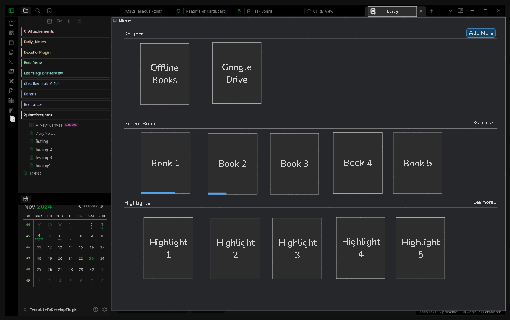
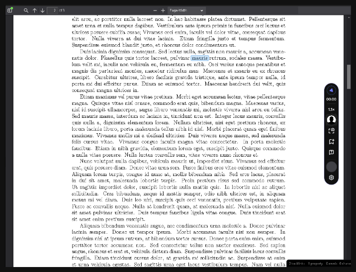

<h1 align="center">Library - plugin for Obsidian</h1>

> Forked from [PDF++](https://github.com/RyotaUshio/obsidian-pdf-plus) by [RyotaUshio](RyotaUshio).

This project is to create a plugin to have an in-built library management system and a speech reader inside Obsidian. The ideas and motivation for this plugin originated from the following discussions on Obsidian Forum :

- [Wanted a better approach to manage my offline books library](https://forum.obsidian.md/t/wanted-a-better-approach-to-manage-my-offline-books-library/91039/6)

- [Built-in Library for PDF en epub workflow (read, highlight, annotate, extract highlights & annotations to a note, synchronized)](https://forum.obsidian.md/t/built-in-library-for-pdf-en-epub-workflow-read-highlight-annotate-extract-highlights-annotations-to-a-note-synchronized/92206?u=tu2_atmanand)

I forked the PDF++ project to give a head start for this plugin, since the PDF++ plugin has the best features in terms of Annotations, highlighting and taking notes from PDF. And also because the project license supports free use, modification and publishing of the software. Read more about all the features from the [PDF++ Readme](https://github.com/RyotaUshio/obsidian-pdf-plus). 

## Roadmap for the plugin development

Following are the features planned for this plugin : 

**Home Page :**

- A custom plugin view to see all the integrated sources, recently read books, recent highlights, etc.
- The plugin homescreen will have features to search and sort books, based on date, updated, author, genre, etc.
- Each book/article/audiobook will be shown as cards with thumbnail. The card will have a progress bar, link to PDF and a button to link to the markdown file for taking notes for the specific file.
- Functionality to create collection, to manually organize your books in virtual folders, whereas the source of the book can be from any location. 

**Speech Reader :**

The following features should be integrated along with the current features of the PDF++ plugin. So, user can listen to the documents like pdf/epubs effortlessly as well as annotate them on the go.

- A controller bar (horizontal or vertical), for controlling features such as, voice speed, volume, different types of voices.
- The voices can be either from the offline ones or can be used from the free online APIs.
- The current spoken words will be highlighted, and the page should be auto-scrolled.
- The user should be able to pause and continue back from the same checkpoint from the last session. Hence, the checkpoint should be stored from the PDF or any other file.
